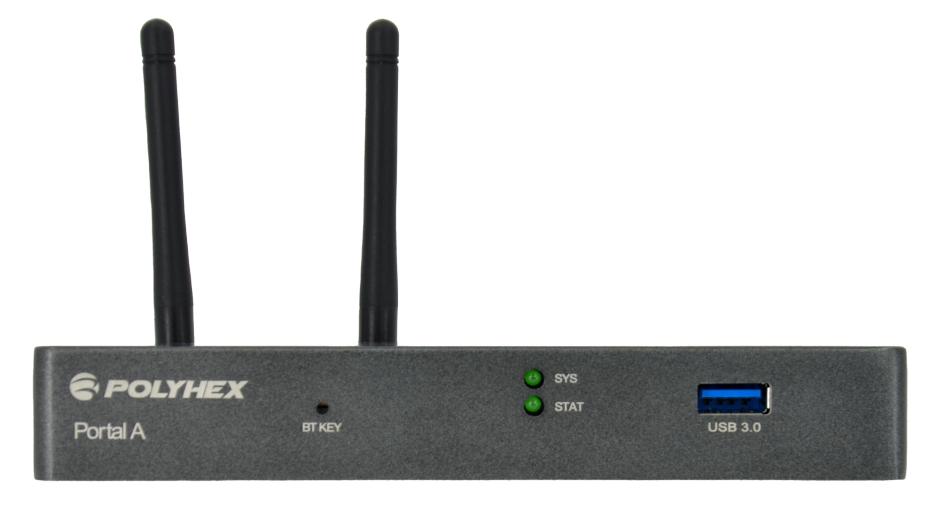
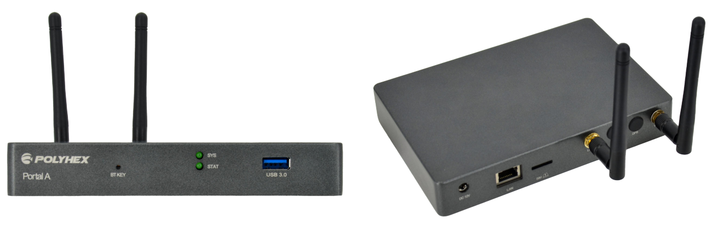
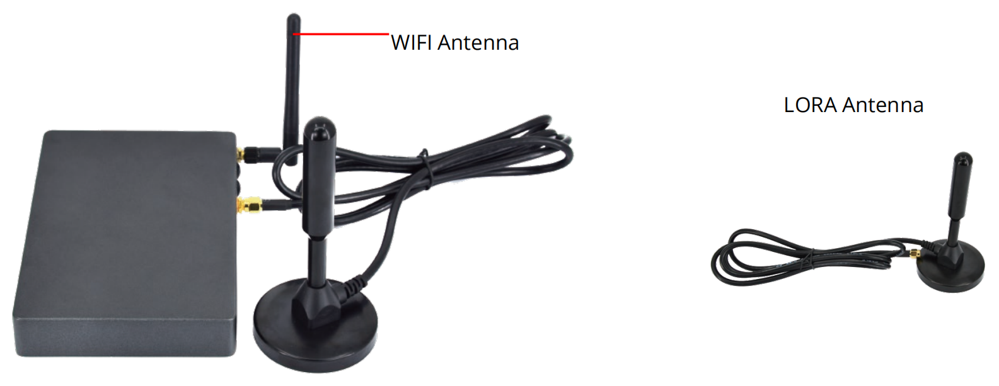

# Portal A Wireless Gateway
 

## Overview
The Portal A is a versatile wireless gateway that offers seamless connectivity and reliable performance. It supports various network options, including Wi-Fi, Gigabit Ethernet, and optional modules like LoRa and 4G. The Portal A is ideal for IoT applications requiring long-range, low-power communication.

## Main Features
- High-performance Quad Core Cortex-A55 CPU up to 1.8GHz
- Built-in Wi-Fi, Gigabit Ethernet, and optional LoRa, 4G, and GPS modules for diverse network options
- Convenient set-up and easy management using a mobile phone 
- Expand coverage range with an optional LoRa antenna
- Support OTA automatic update, stable and reliable

## Specification
| System          |                                                                         |
|-----------------|-------------------------------------------------------------------------|
| CPU             | RK3566, 4 x ARM Cortex-A55, 1.8GHz, comes with an integrated neural processing unit(NPU) that delivers 1TOPS of performance.      |
| Memory          | 1\) Default: 4GB LPDDR4 (8GB optional) 2\) 2GB/4GB/8GB LPDDR4X optional |
| Storage         | 64GB eMMC (128GB/256GB optional)                                        |
| Clipper Chip    | ATECC608                                                                |
| OS              | Debian, Android, Yocto                                                  |
|**Communnication**|                                                                      
| LAN             | 1 x Gigabit Network                                                     |
| LoRa            | 1 x LoRa module (optional), support 470MHz, 868MHz and 915MHz           |
| WiFi & BT       | 2.4GHz & 5GHz Wi-Fi 6, BT 5.4, external Wi-Fi SMA antenna connector     |
| 4G              | 1 x 4G module (optional)                                                |
| GPS             | 1 x GPS module (optional)                                               |
|**I/O Interfaces**|
| SIM             | 1 x SIM slot                                                            |
| Button          | 1 x Bluetooth Pairing Button                                            |
| USB             | 1 x USB 3.0                                                             |
| LED             | 1 x System LED, 1 x Status LED                                          |
| Antennas        | 1 x Wifi Antenna (2.4GHz,3dBi), 1 x LoRa Antenna (optional, 4dBi, 1 m extension cable, with a strong magnetic chuck), 1 x 4G Antenna (optional), 1 x GPS Antenna (optional) |
| RTC             | 1 x RTC                                                                 |
|**Power Supply**|
| Power Input    | DC 12V/2A                                                               |
|**Mechanical & Environmental**|
| Material        | Aluminum alloy                                                          |
| Dimension       | 158.0mm x 107.5mm x 24.5mm (±0.5mm)                                       |
| Net Weight      | 348g (±0.5g)                                                            |
| Operating Temp. | 0°C to 70°C                                                             |

## Product Compliance and Safety:
| CE | FCC |

## I/O Interfaces:

## Antennas:

 

## Safety Instructions and Warnings:
***To avoid malfunction or damage to this product please observe the following:*** 
- Disconnect the device from the DC power supply before cleaning. Use a rag. Do not use liquid detergents or spray-on detergents.
- Keep the device away from moisture.
- During installation, put the device on a reliable table. It will be damaged if you drop it.
- Before connecting the power supply, ensure that the voltage is in the required range.
- Put the power cable in place to avoid stepping on it.
- If the device is not used for a long time, power it off to avoid damage caused by sudden overvoltage.
- For safety reasons, the device can only be disassembled by professional personnel.
- Do not place the device in a place where the ambient temperature is below 0℃ or above 70℃. This will damage the machine. It needs to be kept in an environment at controlled temperature.

## Contact Us
- **Headquarters**: DEBIX Technology Inc., 8345 Gold River Ct., Las Vegas, NV 89113, USA  
- **Factory**: 5-6/F., East Zone, Shunheda A2 Building, Liqxiandong Industrial Park, XiLi, Nanshan Dist., Shenzhen, China  
- **Email**: info@debix.io  
- **Website**: [www.debix.io](https://www.debix.io)  
- **Community**: [Discord](https://discord.com/invite/adaHHaDkH2)